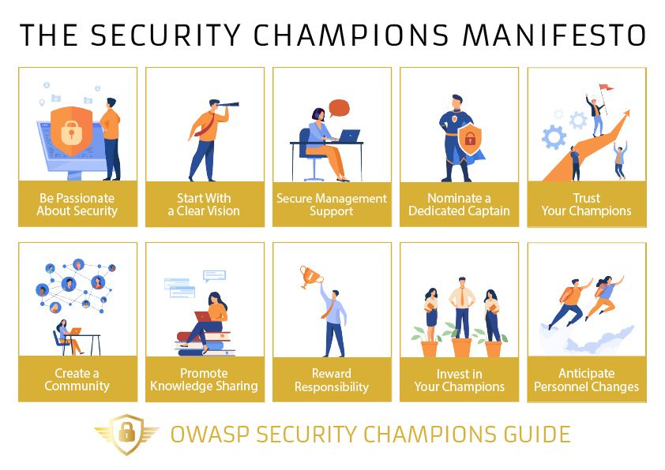

The OWASP Security Champions Manifesto is a set of guiding principles crucial to any successful program!!!!

The principles have been drawn from an initial series of in-depth interviews with Application Security leaders from across the globe as part of our wider goal to provide a comprehensive Security Champions playbook.

Go to the ‘Principles’ tab to find out more about these key principles and how to put them into practice.
 
**The Ten Key Principles for a Successful Security Champions Program**

1. [Be passionate about security](Be_passionate_about_security.md)
2. [Start with a clear vision for your program](Start_with_a_clear_vision_for_your_program.md)
3. [Secure management support](Secure_management_support.md)
4. [Nominate a dedicated captain](Nominate_a_dedicated_captain.md)
5. [Trust your champions](Trust_your_champions.md)
6. [Create a community](Create_a_community.md)
7. [Promote knowledge sharing](Promote_knowledge_sharing.md)
8. [Reward responsibility](Reward_responsibility.md)
9. [Invest in your champions](Invest_in_your_champions.md)
10. [Anticipate personnel changes](Anticipate_personnel_changes.md)

**Prefer a visual? Download your copy of our principles infographic**

